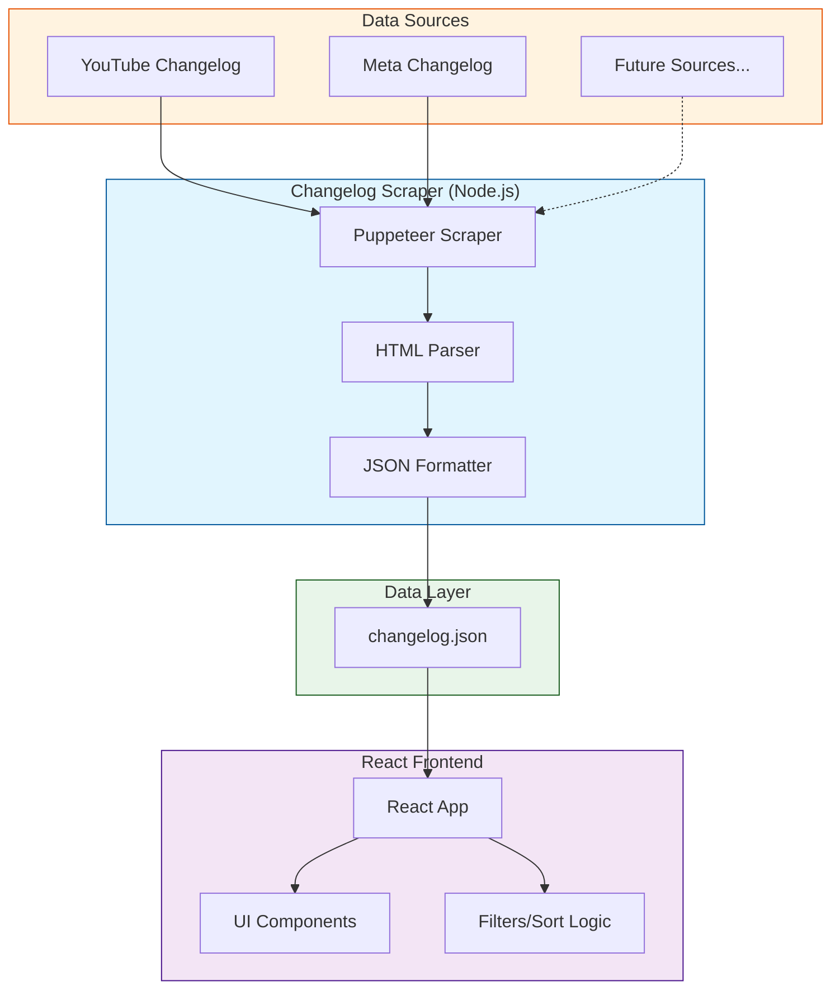

# API Changelog Manager

A unified platform for tracking and managing API changes across multiple platforms. Currently supports YouTube Data API and Meta Graph API changelogs.

## Why Is This Needed?

### Crisis Aversion & Risk Mitigation
- **Critical Update Detection**: Channel API changes can break functionality for thousands of partners if missed
- **Proactive Monitoring**: Eliminates the risk of missing important updates across multiple channels
- **Reduced Escalations**: Prevents crisis situations that arise from unnoticed breaking changes
- **Unified Visibility**: Consolidates changes from multiple platforms in one place, reducing the chance of oversight

### Operational Excellence
- **Time Efficiency**: Eliminates need to manually check multiple changelog pages daily
- **Standardized Process**: Converts varied changelog formats into a consistent, easy-to-understand format
- **Real-time Awareness**: Instant visibility into platform changes affecting our integrations
- **Audit Trail**: Maintains a historical record of all platform changes in a searchable format

## Who Is This For?

### Primary Users
1. **Product Managers**
   - Track platform changes affecting their product areas
   - Plan for necessary adaptations to API changes
   - Make informed decisions about feature development

2. **Channel Partnership Managers**
   - Stay updated on changes affecting partner integrations
   - Proactively communicate changes to partners
   - Assess impact on existing partnerships

3. **Engineering Teams**
   - Quickly understand technical implications of changes
   - Plan necessary code updates
   - Prioritize work based on change criticality

## Architecture Overview

The system consists of two main components:
1. A Node.js-based changelog scraper
2. A React-based web interface



## Features

### Scraper
- Multi-platform support (YouTube, Meta)
- Automated HTML parsing and data extraction
- Standardized JSON output format
- Configurable date range filtering
- Extensible architecture for adding new platforms

### Web Interface
- Real-time filtering by platform, type, and date range
- Sortable columns
- Collapsible detailed views
- Unified change type categorization
- Link deduplication
- Mobile-responsive design

## Project Structure

```
changelog-manager/
├── changelog-viewer/          # React frontend application
│   ├── src/
│   │   ├── App.js            # Main React component
│   │   └── App.css           # Styles
│   ├── package.json
│   └── package-lock.json
├── node_modules/             # Project dependencies
├── package.json              # Project configuration
├── package-lock.json         # Dependency lock file
└── scraper.js               # Changelog scraping script
```

## Getting Started

### Prerequisites
- Node.js 16.x or higher
- npm 8.x or higher
- A modern web browser

### Installation

1. Clone the repository:
```bash
git clone https://github.com/satwik3011/changelog-manager.git
cd changelog-manager
```

2. Install dependencies:
```bash
# Install project dependencies
npm install
```

### Running the Scraper

```bash
node scraper.js
```

This will:
1. Scrape changelogs from configured platforms
2. Process and standardize the data
3. Generate `changelog.json` in the output directory

### Running the Frontend

```bash
cd changelog-viewer
npm start
```

The web interface will be available at `http://localhost:3000`

## Configuration

### Adding New Platforms

1. Add platform-specific scraping logic in `scraper.js`
2. Implement the required functions:
   - `scrapeChangelog()`
   - `processContent()`
   - `formatOutput()`
3. Add platform configuration to `CHANGELOG_URLS`

### Customizing the Frontend

The frontend supports several customization options:

- `TYPE_COLORS`: Modify changelog type colors
- `CHANGELOG_URLS`: Configure platform-specific changelog URLs
- Date formatting and display options

## Future Scope

### AI-Powered Insights
- **Impact Analysis**: AI-generated insights about the potential impact of changes
- **Actionability Scoring**: Automatic assessment of how urgent or important each change is
- **Code Impact Prediction**: AI analysis of which code areas might need updates
- **Smart Categorization**: Automated tagging of changes based on their content
- **Change Pattern Recognition**: Identifying trends in API changes over time

### Enhanced Features
1. **Notification System**
   - Email/Slack integration for critical changes
   - Customizable alerts based on impact level
   - Team-specific notification routing

2. **Impact Dashboard**
   - Visual representation of change impacts
   - Historical trends and patterns
   - Risk assessment metrics

3. **Integration Capabilities**
   - JIRA ticket creation for necessary updates
   - Automatic PR creation for documentation updates
   - Integration with development roadmap tools

4. **Expanded Platform Support**
   - Twitter API changelog integration
   - LinkedIn API changes
   - Additional social media platforms

5. **Collaborative Features**
   - Team comments on changes
   - Change assignee tracking
   - Action item management
   - Change acknowledgment workflow

### Technical Enhancements
- **Real-time Updates**: WebSocket integration for live changes
- **Machine Learning Models**: 
  - Change severity prediction
  - Code impact analysis
  - Breaking change detection
- **Advanced Analytics**:
  - Change frequency analysis
  - Platform stability metrics
  - Impact prediction models

## JSON Schema

The `changelog.json` follows this structure:

```json
{
  "last_updated": "ISO-8601 date",
  "metadata": {
    "platforms": ["YouTube", "Meta"],
    "years_covered": "2023-2024",
    "total_changes": 123
  },
  "changes": [
    {
      "platform": "string",
      "date": "ISO-8601 date",
      "title": "string",
      "type": "Feature Update|API Update|Deprecation",
      "description": "string",
      "endpoints": [
        {
          "method": "string",
          "path": "string",
          "status": "string"
        }
      ],
      "links": [
        {
          "text": "string",
          "url": "string"
        }
      ],
      "flags": {
        "is_deprecation": boolean,
        "is_breaking_change": boolean,
        "requires_action": boolean
      }
    }
  ]
}
```

## Contributing

1. Fork the repository
2. Create a feature branch: `git checkout -b feature/my-feature`
3. Commit changes: `git commit -am 'Add my feature'`
4. Push to branch: `git push origin feature/my-feature`
5. Submit a Pull Request

## Error Handling

The system implements comprehensive error handling:

1. Scraper
   - Network failure recovery
   - Invalid HTML structure handling
   - Rate limiting detection
   - Platform-specific error codes

2. Frontend
   - Data validation
   - Graceful fallbacks for missing data
   - User input sanitization

## Performance Considerations

### Scraper
- Uses Puppeteer in headless mode for optimal performance
- Implements rate limiting to respect platform guidelines
- Caches responses to minimize unnecessary requests

### Frontend
- Implements efficient filtering and sorting algorithms
- Uses React's virtual DOM for optimal rendering
- Implements lazy loading for large datasets

## License

This project is licensed under the MIT License - see the [LICENSE](LICENSE) file for details.

## Acknowledgments

- YouTube Data API Documentation
- Meta Graph API Documentation
- Contributors and maintainers